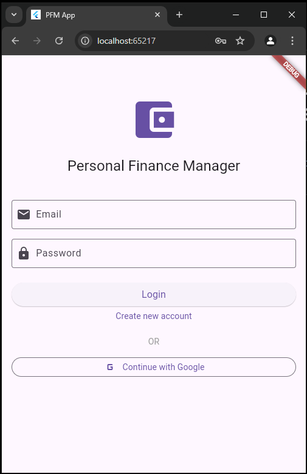
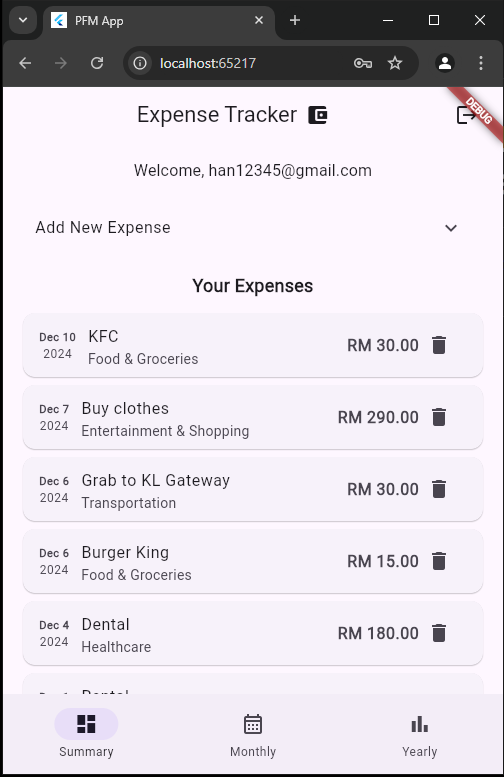
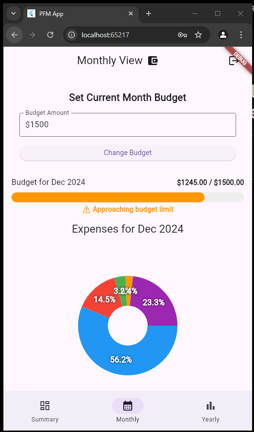
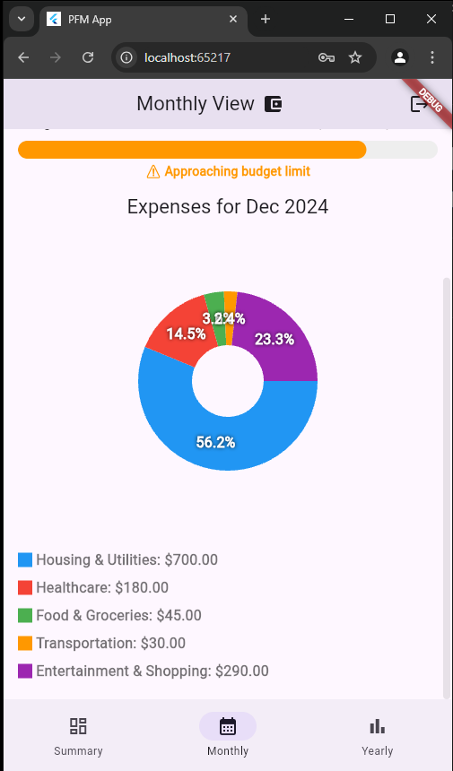
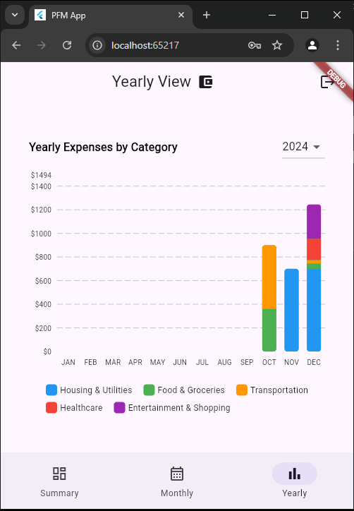

# Expense Tracker App
A Flutter application for tracking personal expenses with Firebase/Firestore integration.

## Prerequisites
- Flutter SDK installed
- Android Studio installed and configured
  - Set up Android Emulator or connect physical device
- Firebase account

## Features
- User Authentication
- Monthly Budget Setting
- Expense Tracking by Categories
- Monthly and Yearly Statistics
- Real-time Updates
- Secure Data Storage with Firebase

## Instructions
1. Clone the repository

2. Install dependencies (bash command: flutter pub get )

### Firebase Configuration
3. Setup Firebase CLI:
   ```bash
   firebase login
   dart pub global activate flutterfire_cli
   ```
4. Configure Firebase:
   ```bash
   flutterfire configure
   ```

   - Select your Firebase project when prompted
   - This will automatically configure your app for all platforms (android/ios/web/linux)

   Note: Running this command will generate new Firebase configuration files for your project while preserving the existing project structure. Only Firebase-specific configurations will be updated in:
 - lib/firebase_options.dart
 - web/index.html (Firebase config section)
 - android/app/google-services.json
 - ios/Runner/GoogleService-Info.plist

5. Enable the following Authentication providers in Firebase Console:
- Email/Password
- Google Sign-in
Path: Firebase Console > Authentication > Sign-in providers

6. Add SHA-1 and SHA-256 fingerprints to Firebase Console > Project Settings > Your Android app
   ```bash
   # Method 1: Using projects debug keystore
   keytool -list -v -keystore [project_directory]/android/app/debug.keystore -alias androiddebugkey -storepass android -keypass android 

   # Method 2: Using Gradle (alternative)
   cd android
   ./gradlew signingReport
   ```
7. Cloud Firestore rules setup
    ```
    rules_version = '2';
    service cloud.firestore {
    match /databases/{database}/documents {
        // Users collection
        match /users/{userId} {
            allow read, write: if request.auth != null && request.auth.uid == userId;
        }
    
    // Expenses collection
    match /expenses/{expenseId} {
      function isOwner() {
        return request.auth != null && 
               resource != null && 
               resource.data.userId == request.auth.uid;
      }

      allow create: if request.auth != null && 
                   request.resource.data.userId == request.auth.uid;
      allow read: if request.auth != null;
      allow update, delete: if isOwner();
    }
    
    // Budgets collection
    match /budgets/{budgetId} {
      function isOwner() {
        return request.auth != null && 
               resource != null && 
               resource.data.userId == request.auth.uid;
      }

      allow create: if request.auth != null && 
                   request.resource.data.userId == request.auth.uid;
      allow read: if request.auth != null;
      allow update, delete: if isOwner();
    }
  }
}```

8. Cloud Firestore Indexes setup
    ```
    Collection: `expenses`
    - Index 1:
    - `userId`: Ascending
    - `date`: Descending

    - Index 2:
    - `userId`: Ascending
    - `date`: Ascending

    - Index 3:
    - `userId`: Ascending
    - `id`: Ascending

    Collection: `budgets`
    - Index 1:
    - `userId`: Ascending
    - `date`: Ascending
    ```

9. Run the app using the command below.
   ```bash
    flutter run 
   ```
   Note: Ensure you have an Android emulator running or physical device connected

## End Product



Page 1 
- User Authentication Page
- Users are able to log in or sign up using Email or Google Authentication.




Page 2 
- Summary Page
- Users are able to view or delete their current spending.
- Users can also add new expenses.

 


Page 3
- Monthly View Page
- Users are able to set their monthly budget.
- A progress bar is available to check how much they have spent compared to their budget.
- Users can also view a breakdown of their expenses by category.






Page 4
- Yearly View Page
- Users are able to view their yearly spending by category.

